## Robot CAMERUS

[kaklik@mlab.cz](mailto:kaklik@mlab.cz); [kakl@i.cz](mailto:kakl@i.cz) M. Novotný

Jak se dělá robot na IstRobot

[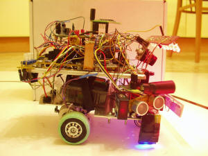](Pictures/image001.jpg)

Úvodem
======

Tato dokumentace popisuje konstrukci robota Camerus, který byl zkonstruován pro soutěž IstRobot pro kategorii Stopár ([http://www.robotika.sk/contest/](http://www.robotika.sk/contest/)).

Snažili jsme se technickou dokumentaci pojmout poněkud netradičně. Kromě popisu finální verze robota zde naleznete chronologický popis jeho vývoje a popis všech slepých uliček. Doufáme, že takováto forma dokumentace bude mít pro naše následovníky větší hodnotu než pouhý návod na zopakování konstrukce.

První pokusy
============

Robot 3Orbis
------------

Vývoj robota Camerus začal před více jak dvěma roky vývojem robota 3Orbis. Robot 3Orbis měl mít novou revoluční koncepci podvozku. Použili jsme tříkolý podvozek, který měl dvě hnaná kola, každé s nezávislým motorem a třetí kolo, které mělo řízené zatáčení. Jednalo se tedy o nonholonomní podvozek. Koncepci podvozku jsme nejdříve ověřovali se dvěma senzory na čáru, jako to měly naši předchozí holonomní roboti. To moc nefungovalo a proto jsme přidali další senzory, pomocí kterých se diskrétně nastavoval úhel zatáčecího kolečka.

  
Obr.1: První pokusy s tříkolým a třímotorovým robotem

[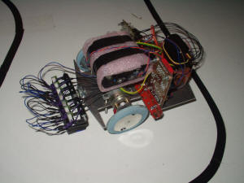](Pictures/image005.jpg)  
Obr.2: Baterie senzorů na čáru

Přidáním dalších senzorů na čáru jsme se dostali do problémů s počtem vstupů použitého procesoru (PIC16F88). Tento problém jsme vyřešili tak, že jsme na zpracování signálů ze senzorů na čáru použili další samostatný procesor. Toto řešení se však později neukázalo jako výhodné, protože ladit distribuovaný kód bylo řádově obtížnější a navíc se musela naprogramovat komunikace mezi procesory. Často se nám také stávalo, že jsme během vývoje do jednoho procesoru nahráli kód pro druhý procesor, což kupodivu vždy trvalo určitou dobu, než jsme na to přišli.

[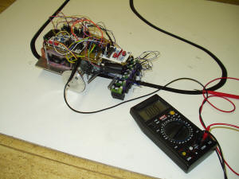](Pictures/image007.jpg)  
Obr. 3: Přední náhon; přidáno druhé patro na elektroniku

Původní koncepce předpokládala hnaná kola vpředu a zatáčecí kolo vzadu. Modelářské servo však nedokázalo dostatečně rychle zatáčet, přestože bylo zpřevodováno do rychla převodem 1:2. Změnili jsme proto uspořádání na hnanou nápravu vzadu a zatáčecí kolečko vpředu. To nám umožňovalo „ostře řezat zatáčky“, ale objevily se další problémy. Podvozek se v zatáčkách dostával do smyku a protože hmotnost čidel byla nezanedbatelná, docházelo i k jeho naklápění a následně k falešnému signálu z čidel, protože čidla nebyla držena v konstantní vzdálenosti od povrchu.

Pro 3Orbise byla vysoustružena duralová kola, pro která bylo plánováno obutí „O“ kroužky. To se pak ukázalo jako nepoužitelné. „O“ kroužky se nedokázaly udržet v drážkách na kolech. Původní kola byla tedy nahrazena plastovými z dětské hračky. Kola měla menší průměr, což zlepšilo převodový poměr, který byl pro vyrobené převodovky 5:1. Jako obutí byly použity ustřižené prsty z latexových rukavic pro domácnost. Jako obutí zatáčecího kolečka bylo použito pryžové těsnění 12x10x2. Na zatáčecí kolečko bylo obuto tak, že se jelo po hraně těsnění.

[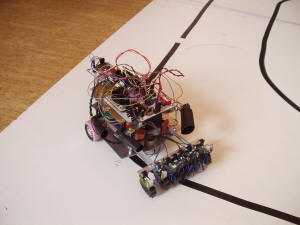](Pictures/image009.jpg)  
Obr.4: Robot 3Orbis. Zadní náhon a menší kolečka z autobusu od syna pana Hronka.  
Je vidět čidlo na hledání hrany cihly.

Pro detekci a objíždění cihly byly na robotovi namontovány IR senzory. Jeden měl detekovat překážku na dráze a zbylé dva měly sloužit pro její objetí. Objetí cihly pomocí IR senzorů jsme však nedokázali odladit. Objíždění nebylo spolehlivé a tak robot nakonec objížděl cihlu naslepo.

Při soutěži se objevil nečekaný problém, kvůli kterému robot nakonec nedojel. Soutěžní dráha je tvořena dvěma deskami. Desky nejsou dokonale slícovány a tak mezi nimi vzniká tmavá mezera. Tato mezera byla na soutěžní dráze přelepena bílou lepicí páskou. Bohužel čidla na čáru, které robot používal, vyhodnocovala bílou lepicí pásku jako černou (čidla pracují blízko ultrafialové oblasti). Tento problém by šel kompenzovat programově, ale na soutěži se nepodařilo program v časové tísni správně upravit. Robot tedy nakonec nedojel.

Odhadovali jsme, že nám chyběl tak týden na odladění firmware, protože v roce 2006 u nás byla povodeň a ztratili jsme tak nejméně jeden kalendářní měsíc večerů/weekendů na programování. Nyní s odstupem času vidíme, že co se týká objetí cihly, chybělo nám mnohem více.

Robot Laserus
-------------

Další verzí robota se shodným podvozkem byl robot Laserus. Snahou bylo odstranit „těžká“ čidla předsunutá před robota a tak odstranit překlápění v ostrých zatáčkách. Řešením by bylo zvětšení dosahu čidel na čáru tak, aby mohla být umístěna co nejblíže k ose otáčení robota. Zároveň by se tím snížila obvodová setrvačná hmotnost robota. Znovu jsme použili tříkolý podvozek s jedním řízeným zatáčecím kolečkem, přestože na IstRobotu 2006 byla tato konfigurace diskutována a autoři druhého robota s podobnou koncepcí se v diskusi vyjádřili, že to nebyl dobrý nápad, že robot při větších rychlostech má snahu se rozkmitávat. Řešení tohoto problému jsme viděli ve zjemnění snímání čáry tak, aby se precizněji nastavovalo zatáčecí kolečko. Napadlo nás použít laserovou čtečku čárového kódu a skutečně jsme postavili funkčního robota (viz Obrázek 5), který dokázal, ale pomalu, jezdit po čáře.

[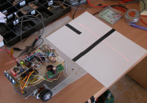](Pictures/image011.jpg)  
Obr. 5: Robot Laserus. Na obrázku je vidět červená stopa LASERu.

Problémy s touto konstrukcí byly dva. Pokud byl na dráze hrbol, tak se v důsledku vibrací zmenšil rozkmit laseru, protože laser je ve čtecím zařízení rozmítáván mechanicky zrcátkem, které vibruje a velké stranové zrychlení při přejetí hrbolu způsobovalo, že elektromagnetický mechanismus, který pohybuje zrcátkem vypadl z rezonance. Tento problém by ovšem zřejmě šlo kompenzovat softwarem, protože se čára četla v obou směrech pohybu zrcátka. Jednou jsme tedy dostali polohu čáry měřenou z leva a jednou z prava.

Druhý problém byl závažnější. Protože bylo použito zařízení na čtení čárového kódu, snímali jsme vlastně polohu jedné čáry fiktivního čárového kódu ve scanovaném prostoru. V prudké zatáčce však dochází k tomu, že čáru vidí snímač šikmo a tak se relativně zvětšuje její tloušťka. Vnitřní elektronika snímače vyhodnotila tento stav, jako že se nejedná o čárový kód a čáru vyfiltrovala. To samozřejmě mělo v ostré zatáčce fatální následky. Dále jsme touto cestou nepokračovali, přesto, že víme, že v závodě DARPA se často používají laserové dálkoměry. Na soutěžních vozech je však vidět, že konstruktéři také mají problémy s odtlumením vibrací.

Robot Camerus
=============

Znovu se vynořil nápad, použít pro snímání čáry kameru. To už nás napadlo několikrát, ale když jsme nápad analyzovali, vždy se ukázalo, že jednoduchým jednočipovým mikropočítačem nelze zpracovávat obraz kamery. Druhým problémem je, že běžně dostupné kamery mají snímkový kmitočet 50Hz, což se nám zdálo na snímání čáry pomalé. Přesto jsme zakoupili jednu kameru a začali jsme osciloskopem testovat, co tak kamera vidí a jak by se to dalo zpracovat. Kupodivu jsme zjistili, že s procesorem na 20MHz stíháme načíst jeden obrazový řádek asi s polovičním rozlišením. To bylo povzbudivé a zaměřili jsme se tímto směrem.

Druhým problémem bylo, že kamera nesnímá kontrastní obraz. Jak se vypořádat v jednočipovém počítači s tímto problémem, když jeho výpočetní výkon stačí sotva na načtení řádku a ještě se musí počítat regulace pro elektronický diferenciál? (Pro zvolenou koncepci podvozku je nutné diferencovat otáčky motorů na hnaných nápravách.)

Problém jsme vyřešili něčím, čemu jsme pracovně začali říkat „digitální komparátor“. Jednoduše jsme pomocí logických hradel provedli OR třech nejvyšších bitů jasového signálu z kamery. Všechno co bylo pod 0x1F bylo tedy černé a všechno nad bylo bílé. Expozici kamery pak bylo nutné nastavit tak, aby nejsvětlejší černá čára, byla ještě černá. To se udělalo snadno osciloskopem, ale pro závod bylo nutné vyvinout nějakou strategii, jak robot provede určení expozice. Řešením byla rutina „Expozimetr“, která postupně zvyšuje expoziční čas a hledá ve snímku (samozřejmě, že v našem případě na jedné řádce) čáru definované tloušťky. Vychází se z toho, že nejdříve při podexponování je černý celý obrázek, pak se postupně obrázek vyjasňuje, což je ovšem díky chybě apertury objektivu nerovnoměrné. Dalším zvyšováním času expozice se nakonec objeví čára správné tloušťky, ta se pak dále ztenčuje a nakonec je snímek přepálen a čára zmizí. Samozřejmě se předpokládalo, že na startu robot čáru vidí a ta je před ním přibližně uprostřed.

První pokusy vypadaly velmi optimisticky, robot se držel čáry a vyjel jenom občas. Zajímavé bylo, že robot dokázal jezdit jenom po dráze, kde nebyly zatáčky doleva! Protože jsme neměli k dispozici obraz z kamery, aby bylo možné zkontrolovat co kamera vidí, bylo nutné tento problém řešit pouhou úvahou. Napadlo nás, že může docházet k „vytrhávání obrazu“ na krajích snímku. Kompenzovalo se to tím, že se zahazovaly okraje řádku a skutečně to pomohlo, robot spolehlivě, i když pomalu, sledoval čáru. To byl velký úspěch, protože kdyby nám někdo řekl před rokem, že to s kamerou a jednočipovým počítačem jde, a že je to spolehlivé, asi by jsme mu nevěřili.

Po prvotních úspěších jsme zkusili zrychlit jenže to nefungovalo, robot vždy vypadl z dráhy, když se zatáčecí kolečko otočilo o velký úhel. Napadlo nás, že to může být způsobeno proudovými špičkami, které způsobuje motor serva. Pro stabilizaci napájení pro elektroniku byl totiž použit lineární stabilizátor s velkým drop-outem. Proto jsme vyvinuli měnič, který i při poklesu napětí baterií o 2V dokázal udržet napětí pro řídící elektroniku a zejména kameru stabilní. Po tomto vylepšení už robot dosahoval poměrně slušné rychlosti a nejzajímavější bylo, že díky „velké“ rozlišovací schopnosti kamery (procesor dokázal rozlišit asi 50 bodů) byla jízda v zatáčkách velmi plynulá.

Problém s tmou v tunelu byl vyřešen jednoduše tak, že si robot celou cestu svítil. Na osvětlení dráhy byly použity červené LED. Nevíme, jaká barva pro osvětlení dráhy je nejlepší, eventuelně, jestli je lepší svítit bíle. S tím jsme už nestihli před soutěží experimentovat.

Protože použitý procesor PIC16F876A neumí násobit a vůbec jeho výpočetní výkon není omračující (kdybychom ho ale měli před lety, tak by jsme si určitě nestěžovali), byl celkem problém naprogramovat elektronický diferenciál na hnanou nápravu. Nakonec se to vyřešilo procedurou „jakonásobení“, která kombinací rotací a podmíněného sčítání provádí rychle potřebný výpočet s uspokojivou přesností.

[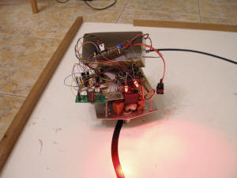](Pictures/image013.jpg)  
Obr. 6: Měnič v krabičce od čaje a primitivní osvětlení dráhy.

[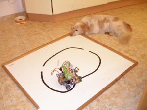](Pictures/image015.jpg)  
Obr. 7: Robot, přítel člověka.

Začali jsme tedy testovat pro sledování čáry asi nejobtížnější věc, dlouhou rovinku a na konci pravoúhlou zatáčku. Při dalším zvyšování rychlosti začal robot v takové zatáčce vypadávat. Ne, že by přímo vyjel a nevrátil se na dráhu, ale poloměr zatáčení byl menší než poloměr zatáčky a hrozilo tedy, že v Bratislavě spadne ze stolu. Udělali jsme předpoklad, že je to způsobeno pomalým snímkovým kmitočtem kamery, než si robot stačil všimnout, že je zatáčka ostrá, zmizela mu čára ze zorného pole.

Dalším problémem bylo, že pokud bylo nerovnoměrné osvětlení dráhy, vypadával kameře obraz. Kamera má sice AGC, ale samozřejmě, že je schopna kompenzovat rozdíly jasu jenom v určitých mezích. Kupodivu nebyl problém v tunelu, kde si robot svítí, ale velký problém byl s denním světlem, pokud přicházelo pouze z jednoho směru.

Konstrukční řešení, které následovalo, bylo doplnění dvou původních modrých čidel po stranách robota na sledování čáry. Čidla byla umístěna tak, že viděla čáru, až když čára byla mimo zorné pole kamery a uplatňovala se pouze v případě, že kamera čáru nevidí. To velmi zvýšilo spolehlivost sledování čáry. Zároveň jsme tato čidla použili pro opětovné vyhledání čáry po objetí cihly, protože jsme se báli pro tento úkol použít kameru, protože po dobu objíždění cihly kamera nevidí kontrastní obrázek (nevidí čáru) a díky AGC by mohla zaznamenat stín nebo špínu na trati jako čáru.

Na objíždění cihly byl robot Camerus vybaven odometrií na pravém kole. Využili jsme otvorů ve větším kole převodovky a IR závory z tiskárny. Citlivost odometrie nebyla velká (4 impulzy na jednu otáčku kolečka (12,6mm)).

Jak jsme jeli „ladit“ do Vídně
------------------------------

Vše potřebné bylo naprogramováno, robot sledoval čáru. Přerušení nedělalo problémy, prostě byl výpadek obrazu a robot pokračoval v původním směru před přerušením. Cihla byla řešena pomocí odometrie. Takto vybaveni jsme odjeli do Vídně na Robot Challenge 2007. Řekli jsme si, že to tam odladíme, protože jsou tam jednodušší podmínky než v Bratislavě (alespoň na první pohled, robot může být větší a tunel je také větší, takže menší robot nemusí jet tak přesně).

Rozhodnutí ladit robota na Robot Challenge se ukázalo jako správné. Podmínky totiž byly náročné. Bodové osvětlení, dráha složená z desek s mezerami, styl soutěže play-off.

Camerus určitě jezdil nejrychleji, ale nedokázal objet cihlu! Jednou se stalo, že uviděl mezeru mezi deskami, podruhé mu zřejmě proklouzlo kolečko s odometrií, prostě katastrofa! Alespoň, že byl třetí v paralelním slalomu, to jsme mu ale zavinili my, protože jsme mu při zkoušení objetí cihly stáhli výkon motorů a pak jsme na to zapomněli. Za třetí místo tedy nemohl robot, ale lidský faktor.

[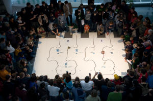](Pictures/image017.jpg)  
Obr. 8: Robot Challenge 2007, Parallel Slalom.  
Robot Camerus na dráze číslo 1. Na dráze jsou patrné stíny od bodového osvětlení.

[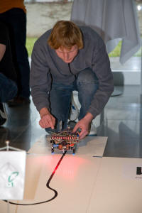](Pictures/image019.jpg) [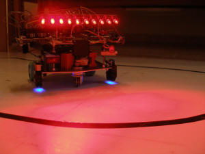](Pictures/P3180028.JPG)  
Obr. 9: Robot Camerus na Robot Challenge 2007.  
Robot nemá dostatek čidel na bezpečné objetí překážky.

Jednoznačně se ukázalo, že objíždět překážku „napůl naslepo“ není dobrá strategie a zejména, pokud je odometrie na hnané nápravě.

Co s cihlou?
------------

Další vývoj jsme věnovali objíždění cihly za pomoci čidel. Jaká čidla ale použít? Měli jsme špatné zkušenosti s IR čidly z 3Orbise a roboty s ultrazvukem jsme zase na minulých ročnících viděli, že si spletli tunel s cihlou, případně neviděli cihlu, pokud se k ní blížili zešikma.

Nevěděli jsme co s tím a tak jsme začali zkoušet. Měřili jsme, co „vidí“ ultrazvuk a co různá optická čidla. Při měření se ukázaly všechny předpokládané problémy. Ultrazvuk vidí kde co, jenom ne cihlu, když je šikmo. IR snímač vidí cihlu sice spolehlivě, ale stejně dobře jako velkou bílou zeď několik metrů daleko. Nakonec byla pro cihlu zvolena kombinace sedmi senzorů. Skutečně čtete dobře, sedmi! Jeden IR senzor vpředu na detekci přiblížení se k cihle. Funguje na principu triangulace. IR vysílací dioda má úzkou hliníkovou trubičkou zúžen paprsek, aby nedocházelo k jeho integraci na velké vzdálené ploše. Další dva senzory jsou mikrospínače na mechanickém nárazníku, kdyby se stalo, že triangulační čidlo cihlu přehlédne. To se může stát v prudké zatáčce. Z boku jsou pak ultrazvukový senzor a on/off dálkoměr s červenou LED. Tyto čidla udržují konstantní vzdálenost od cihly při jejím objíždění. K tomu ještě již zmíněná odometrie na pravém kolečku, která zajišťuje prudkou zatáčku doleva jakmile je cihla detekována a nakonec kompas, který zabraňuje, aby se robot vracel zpět po trati (to se může stát, protože mezi předním čidlem a bočními čidly je slepý úhel).

Přidání dalších čidel se neobešlo bez konstrukčních problémů. Boční LED čidlo se ukázalo jako málo citlivé a bylo to zřejmě způsobeno tím, že se jedná o průmyslové čidlo, které je normálně napájeno napětím 12 až 48V. S naším napájecím napětím 7,2V a to ještě občas, nebylo moc spokojeno. Byl tady přidán další měnič nahoru na 12V. Byl použit měnič ze staré síťové karty.

Samostatným konstrukčním problémem bylo umístění kompasu. Nakonec musel být kompas umístěn nad všechny desky s elektronikou a musel být orientován tak, aby čidla kompasu byla pod úhlem 45° k ose robota. Pokud byla čidla v ose robota, byl kompas ovlivňován zbytkovým magnetickým polem v kovových (zejména železných) částech robota.

Poslední weekend před soutěží
-----------------------------

Přidání kompasu na I2C sběrnici si vyžádalo přeadresaci kamery, protože kamera a kompas měly na I2C sběrnici stejnou adresu a adresa kompasu se nedala změnit. To kupodivu byl velký problém, který jsme řešili až poslední weekend před soutěží a přitom vyžadoval tak zásadní zásah jako rozebrání objektivu kamery, což znamenalo pečlivé čištění pouzdra a čipu kamery, protože případné smítko na pouzdře čipu by mělo při soutěži fatální následky. Čip kamery sice přeadresaci umí, ale bylo nutné připojit vývod MULT (47) na log\_1 a na to kupodivu na plošném spoji kamery nebylo pamatováno, přesto, že na plošném spoji jsou plošky na odpory, které umožňují změnu adresy.

[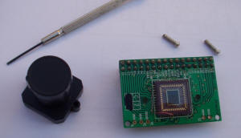](Pictures/image021.jpg)  
Obr. 10: Propojka na PCB kamery umožňující její přeadresaci.

Poslední weekend před soutěží nás napadlo ještě jednou projít seznam problémů, které jsme si poznamenali v průběhu loňské soutěže. Hned na začátku tam bylo: „Zkontrolovat, jestli neprokluzují kolečka na hřídeli.“ Prokluzovala... Zkusili jsme je přilepit anaerobním lepidlem. Výsledek byl, že se zalepily hřídelky do ložisek a kolečka prokluzovala dál. Zkusili jsme je přilepit epoxidem. Naneštěstí nám trochu epoxidu zřejmě nateklo do ložisek a kolečka se zase utrhla. Poslední neděli před soutěží jsme tedy měli zatuhlé převodovky a kolečka prokluzovala. Snažili jsme se do hřídelek vyvrtat dírky a dát tam kolík, ale vrták vůbec nitridovanou ocel z CD mechanik nebral. Nakonec jsme do hřídelek pouze vypilovali drážky a opět jsme je zalili epoxidem. Jestli neprokluzují, jsme pro jistotu už nezkoušeli.

Při manipulaci s pravou převodovkou se podařilo ulomit vývod od IR závory na odometrii. Protože nešla vyměnit (je zalepená v pŕevodovce) a nechtěli jsme měnit celou převodovku, natavili jsme její pouzdro pájkou a drátek přiletovali na pahýl vývodu.

Po rozebrání bylo nutné převodovky nechat znovu zaběhnout, to jsme dělali přes noc z pondělí na úterý (IstRobot bývá ve středu a my tam obvykle jedeme v úterý dopoledne). Motory se točily do rána do poslední chvíle před naložením robota do auta.

Noc před soutěží
----------------

„Kdyby nebylo poslední noci, tak není žádný projekt dokončen.“ Odpoledne jsme přijeli do Bratislavy na ubytovnu, rozložili dráhy a začali ladit poslední řádky programu. V našem případě to mělo být zpracování logu z jízdy.

A vůbec to nejezdilo. Robot měl malý výkon v levotočivé zatáčce, při objíždění cihly se dokonce občas zastavil. No jasně, řekli jsme si, jsou stále zatuhlé převodovky, změnili jsme pár konstant v programu a jakš takš to zase jezdilo. Situace se ale o půlnoci zase zhoršila a začal smrdět H-můstek. Vyměnili jsme tedy H-můstek a nepomohlo to. Vyměnili jsme tedy motor a pomohlo to! (Pozdější analýzou záznamu použitého dílu bylo zjištěno, že motor č.2 byl použit spolu s původním podvozkem na výstavě Vzdělání a Řemeslo v Českých Budějovicích, kde byla levotočivá trať a jeho provozní doba tak vzrostla o desítky hodin proti motoru č.1 .) Po výměně motoru jsme vrátili do robota původní H-můstek (asi tak v jednu hodinu ráno) a zase to nejelo. Měřením jsme pak zjistili dvě věci, jednak byly přes pájecí lak odizolovány zemnící šrouby na plošném spoji H-můstku a tak všechen proud tekl přes hřebínkový konektor a pak tam ještě byl zkrat přes jeden tranzistor H-můstku, takže jeden motor nereverzoval. Představte si, že tyto závady byly vykompenzovány jednak regulátorem v software a také koncepcí podvozku, a že s nimi byl Camerus na Robot Challenge třetí!

Pak už jenom stačilo doprogramovat tu logovací proceduru (přepisovala paměť). A kolem páté hodiny ranní byl robot připraven na soutěž.

IstRobot 2007
-------------

IstRobot 2007 nás skutečně překvapil, byla na něm z našeho pohledu nejsložitější dráha, jakou jsme kdy viděli. Extrémně dlouhé přerušení, navíc v inflexním bodě (to nás vůbec nenapadlo, že je možné), cihla hned za pravoúhlou zatáčkou (sotva robot vyjede ze zatáčky, bác, a je tu cihla), viz Obrázek 11.

[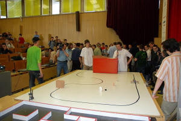](Pictures/image023.jpg)  
Obr. 11: IstRobot 2007 – tvar dráhy.

Potenciálním problémem byly magnetické stojánky na kterých stála čidla časomíry. Magnetické pole nad dráhou bylo díky nim značně nehomogenní (stojánek na Obr. 11 vlevo dole a dva stojánky na startu). Robot využíval kompas pouze u cihly, a zřejmě byl stojánek dostatečně daleko/blízko, že nakonec nevadil. Údaje z kompasu se zpracovávaly diferenčně, takže nevadilo, že byla díky stojánkům odchylka v celkové orientaci magnetického pole Země, podstatné bylo, aby nedocházelo k velkým zakřivením pole v oblasti cihly. K čemuž, jak jsme změřili, částečně docházelo, ale software se s tím vypořádal, když vážil údaje ze všech čidel při objíždění překážky.

Obtížnost trati se ukázala hned v první jízdě, Camerus vypadnul na přerušení. V druhé jízdě jsme snížili výkon motorů, zde ale zase hrozilo, že se robot nerozjede, pokud někde (například při objíždění cihly) výrazně zpomalí. Robot jel plynuleji, přesto vyjel v přerušení (to dá rozum, protože kopíroval tvar dráhy před přerušením), vyhnul se tunelu, znovu našel dráhu (to fungovalo dobře) a na podruhé projel. Byl to úspěch, ale velká časová ztráta a navíc si robot špatně zapamatoval dráhu pro další jízdu, protože bloudil.

Programovali jsme místo oběda a nakonec jsme to přerušení vyřešili. Prostě jsme zohlednili, že dráha za přerušením může pokračovat i na druhou stranu. Zní to jednoduše, ale úprava programu nebyla tak jednoduchá, viz soutěžní verzi [firmware](http://www.mlab.cz/WebSVN/listing.php?repname=MLAB&path=/Designs/ROBOTS/Camerus/sw/#_Designs_ROBOTS_Camerus_sw_).

Finálová jízda proběhla bez problémů, robot sice jel na méně jak polovinu regulačního rozsahu a bez našeho zásahu by se s dráhou dobře nevypořádal, ale jsme rádi, že dojel a nakonec stejně za to nemohl robot, ale my, že jsme mu naprogramovali, že dráha za přerušením nemůže vést na druhou stranu. Nakonec se podařilo s robotem s časem 12,5s udělat „rekord trati“ ;-)

[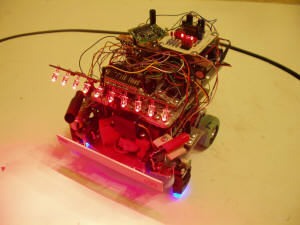](Pictures/image025.jpg)  
Obr. 12: Robot Camerus - finální verze robota.

[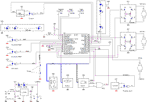](Pictures/index.2.gif)  
Obr. 13: Blokové schéma propojení modulů robota.

Podklady
========

Desky plošných spojů a popis jednotlivých modulů robota naleznete na [http://www.mlab.cz/](http://www.mlab.cz/) .

Deska procesoru
---------------

[http://www.mlab.cz/WebSVN/listing.php?repname=MLAB&path=/Modules/PIC/PIC16F87xSO2801A/#\_Modules\_PIC\_PIC16F87xSO2801A\_](http://www.mlab.cz/WebSVN/listing.php?repname=MLAB&path=%2FModules%2FPIC%2FPIC16F87xSO2801A%2F#_Modules_PIC_PIC16F87xSO2801A_) [http://www.mlab.cz/WebSVN/listing.php?repname=MLAB&path=/Modules/PIC/PIC16F87xDIL2801A/#\_Modules\_PIC\_PIC16F87xDIL2801A\_](http://www.mlab.cz/WebSVN/listing.php?repname=MLAB&path=%2FModules%2FPIC%2FPIC16F87xDIL2801A%2F#_Modules_PIC_PIC16F87xDIL2801A_)

H-můstky
--------

[http://www.mlab.cz/WebSVN/listing.php?repname=MLAB&path=/Modules/H\_Bridge/#\_Modules\_H-Bridge\_](http://www.mlab.cz/WebSVN/listing.php?repname=MLAB&path=%2FModules%2FH_Bridge%2F#_Modules_H-Bridge_)

LEDbar
------

[http://www.mlab.cz/WebSVN/listing.php?repname=MLAB&path=/Modules/HumanInterfaces/LEDbar/#\_Modules\_LEDbar\_](http://www.mlab.cz/WebSVN/listing.php?repname=MLAB&path=%2FModules%2FHumanInterfaces%2FLEDbar%2F#_Modules_LEDbar_)

Měnič
-----

[http://www.mlab.cz/WebSVN/listing.php?repname=MLAB&path=/Modules/PowerSupply/BATPOWER02A/#\_Modules\_PowerSupply\_BATPOWER02A\_](http://www.mlab.cz/WebSVN/listing.php?repname=MLAB&path=%2FModules%2FPowerSupply%2FBATPOWER02A%2F#_Modules_PowerSupply_BATPOWER02A_)

IR modulátor
------------

[http://www.mlab.cz/WebSVN/listing.php?repname=MLAB&path=/Modules/CommIR/TXIR/#\_Modules\_CommIR\_TXIR\_](http://www.mlab.cz/WebSVN/listing.php?repname=MLAB&path=%2FModules%2FCommIR%2FTXIR%2F#_Modules_CommIR_TXIR_)

Osvětlení dráhy
---------------

[http://www.mlab.cz/WebSVN/listing.php?repname=MLAB&path=/Designs/ROBOTS/Camerus/LEDpanel/#\_Designs\_ROBOTS\_Camerus\_LEDpanel\_](http://www.mlab.cz/WebSVN/listing.php?repname=MLAB&path=%2FDesigns%2FROBOTS%2FCamerus%2FLEDpanel%2F#_Designs_ROBOTS_Camerus_LEDpanel_)

Univerzálka pro 7432
--------------------

[http://www.mlab.cz/WebSVN/listing.php?repname=MLAB&path=/Modules/Universal/UNIDIL1601A/](http://www.mlab.cz/WebSVN/listing.php?repname=MLAB&path=/Modules/Universal/UNIDIL1601A/)

Modul trimrů
------------

[http://www.mlab.cz/WebSVN/listing.php?repname=MLAB&path=/Modules/HumanInterfaces/TRIMQUAD01A/#\_Modules\_TRIMQUAD01A\_](http://www.mlab.cz/WebSVN/listing.php?repname=MLAB&path=%2FModules%2FHumanInterfaces%2FTRIMQUAD01A%2F#_Modules_TRIMQUAD01A_)

Dokumentace k použitému kamerovému čipu
---------------------------------------

[http://www.cmucam.org/attachment/wiki/Documentation/OV6620.PDF](http://www.cmucam.org/attachment/wiki/Documentation/OV6620.PDF)

Dokumentace k US senzoru
------------------------

[http://www.robot-electronics.co.uk/htm/srf08tech.shtml](http://www.robot-electronics.co.uk/htm/srf08tech.shtml)

Dokumentace ke kompasu
----------------------

[http://www.robot-electronics.co.uk/htm/cmps3doc.shtml](http://www.robot-electronics.co.uk/htm/cmps3doc.shtml)

Dokumentace k robotu 3Orbis
---------------------------

[http://www.mlab.cz/WebSVN/listing.php?repname=MLAB&path=/Designs/ROBOTS/3Orbis/#\_Designs\_ROBOTS\_3Orbis\_](http://www.mlab.cz/WebSVN/listing.php?repname=MLAB&path=%2FDesigns%2FROBOTS%2F3Orbis%2F#_Designs_ROBOTS_3Orbis_)

Video
-----

Videozáznam, jak Camerus jezdil při soutěži IstRobot 2007:  
[1. jízda](../video/1.wmv), [2. jízda](../video/2.wmv), [3. jízda](../video/3.wmv).

<!-- SetRelativePath("../../../../../"); DrawFooter(); // -->

**Pro zobrazení (vložení) hlavičky je potřeba JavaScript**
